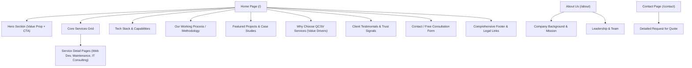

# Project Guidelines: QCSV Services Website

## 1. Executive Summary & Vision
**QCSV Services** (QCSV Services Private Limited) is establishing a modern, high-impact digital presence. The website aims to establish brand authority, showcase core competencies (technology solutions, software services, website development & maintenance, multimedia, and digital operations), and convert prospective clients and partners.

This document serves as the single source of truth for architectural standards, design philosophy, code conventions, and project execution guidelines throughout the development lifecycle.

---

## 2. Project Scope & Objectives

### Core Objectives
1. **Brand Modernization & Authority**: Present QCSV Services as a premier, state-of-the-art technology services provider with cutting-edge visual aesthetics and seamless UX.
2. **Lead Generation & Conversion**: Provide clear calls-to-action (CTAs), service inquiry funnels, and frictionless communication channels (contact forms, quote requests, direct chat/email hooks).
3. **Showcase Portfolio & Capabilities**: Highlight services, case studies, technology stacks, client impact, and operational expertise.
4. **Performance & SEO Excellence**: Deliver near-instant load times (<1.2s FCP), 100/100 Lighthouse performance targets, semantic HTML5, and rich structured data (Schema.org).

---

## 3. Technology Stack & Technical Architecture

### Core Tech Stack
* **Structure & Semantics**: Semantic HTML5 with modern accessibility attributes (`aria-*`, landmark roles).
* **Styling Architecture**: Modern CSS (CSS Custom Properties / Variables, Flexbox, CSS Grid, Container Queries, `oklch()` color spaces, smooth transitions).
* **Scripting & Interactivity**: Clean, modular Vanilla JavaScript (ESNext) with Web APIs (Intersection Observer, Dialog API, Popover API, View Transitions).
* **Build / Dev Tooling**: Lightweight Vite or Static Dev Server for fast Hot Module Replacement (HMR) and optimized production bundles.
* **Assets & Media**: Modern WebP/SVG formats, lazy loading, responsive `srcset`, and optimized vector icons.

### Architectural Principles
* **Component-First Structure**: UI components are logically encapsulated with their styling and behavior.
* **Progressive Enhancement**: Base content is fully functional and accessible without JavaScript; rich animations and dynamic behaviors layer on top.
* **Zero Bloat Policy**: Avoid heavy, monolithic external UI frameworks unless explicitly justified. Keep bundle sizes minimal.

---

## 4. Visual Design & Aesthetic Standards

Adhering to modern, premium digital product design:

### Design Pillars
1. **Curated Color Harmony**:
   * Deep corporate tech palette: Dark slate/obsidian (`#0B0F19`), rich midnight navy (`#0F172A`), accented with vibrant electric cyan (`#06B6D4`), radiant blue (`#3B82F6`), and emerald teal accents.
   * High-contrast accessibility compliant with WCAG 2.1 AA.
2. **Modern Typography**:
   * High-grade Google Fonts pairing (e.g., **Outfit** or **Plus Jakarta Sans** for commanding headlines; **Inter** for crisp, legible body text).
3. **Depth & Texture**:
   * Subtle glassmorphism (`backdrop-filter: blur(16px)`), modern card borders (`1px solid rgba(255, 255, 255, 0.08)`), refined multi-layered drop shadows.
4. **Micro-Interactions & Motion**:
   * Dynamic hover states, smooth entry reveals on scroll, interactive button shines, and responsive feedback for all user inputs.

---

## 5. Site Architecture & Page Structure



---

## 6. Guidelines for Processing User References & Screenshots

When the user provides previous website screenshots and reference websites:
1. **Screenshot Deconstruction**:
   * Extract key content blocks, offerings, and value propositions.
   * Identify pain points in previous designs (outdated typography, poor mobile responsiveness, cluttered layouts).
2. **Reference Site Analysis**:
   * Catalog visual highlights (color usage, navigation style, micro-interactions, layout patterns).
   * Note functionality to emulate or improve upon.
3. **Mapping & Transformation**:
   * Map old content into modern component structures defined in `SYSTEM_INTERFACE.md`.
   * Upgrade copy with high-impact, professional messaging.

---

## 7. Quality Assurance & Performance Benchmarks

| Metric | Target | Method / Tool |
| :--- | :--- | :--- |
| **Performance (Lighthouse)** | $\ge$ 95 | Chrome DevTools / Lighthouse |
| **Accessibility (a11y)** | 100 (WCAG 2.1 AA) | Axe DevTools, Screen Readers |
| **Best Practices** | 100 | Lighthouse Audit |
| **SEO Score** | 100 | Metadata, OpenGraph, JSON-LD schema |
| **First Contentful Paint (FCP)** | < 1.0s | Real User Monitoring / DevTools |
| **Cumulative Layout Shift (CLS)** | 0.00 | Dimensioned media, font display swap |
| **Mobile Responsiveness** | Fully fluid (320px to 4K) | Chrome Responsive Mode & Real Devices |

---

## 8. Directory & File Organization

```
qcsvservices/
├── PROJECT_GUIDELINES.md      # Strategic overview, architecture, quality standards
├── SYSTEM_INTERFACE.md        # Detailed UI specifications, tokens, and component contracts
├── assets/                    # Static assets
│   ├── images/                # Brand imagery, project graphics, team photos
│   ├── icons/                 # SVG icons
│   └── references/            # Uploaded screenshot references & wireframe notes
├── css/                       # Modular stylesheet architecture
│   ├── variables.css          # Design tokens (colors, typography, spacing)
│   ├── base.css               # Reset, typography, utility classes
│   ├── components.css         # Buttons, cards, modals, form controls
│   └── layout.css             # Header, navigation, grid systems, footer
├── js/                        # Modular JavaScript
│   ├── app.js                 # Application bootstrap & init
│   ├── navigation.js          # Mobile drawer, scroll header, active links
│   ├── animations.js          # Intersection observer scroll animations
│   └── form-handler.js        # Contact & inquiry validation & submission
└── index.html                 # Main landing page
```
