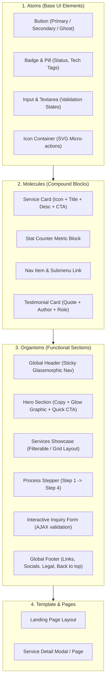

# System Interface Specification: QCSV Services

This document specifies the design system tokens, UI component specifications, interactive contracts, and behavioral states for the QCSV Services website interface.

---

## 1. Design System Tokens

### 1.1 Color Tokens (Dark & Light Foundations)

```css
:root {
  /* Surface & Backgrounds */
  --bg-primary: #070B14;
  --bg-secondary: #0D1322;
  --bg-tertiary: #131C31;
  --bg-glass: rgba(13, 19, 34, 0.72);
  --bg-glass-elevated: rgba(19, 28, 49, 0.85);

  /* Borders & Dividers */
  --border-subtle: rgba(255, 255, 255, 0.07);
  --border-glow: rgba(56, 189, 248, 0.28);
  --border-focus: #38BDF8;

  /* Accent & Primary Branding */
  --brand-primary: #0EA5E9;       /* Vivid Sky Blue */
  --brand-secondary: #6366F1;     /* Electric Indigo */
  --brand-accent: #10B981;        /* Emerald Precision */
  --brand-gradient: linear-gradient(135deg, #0EA5E9 0%, #6366F1 50%, #A855F7 100%);
  --brand-glow: 0 0 35px rgba(14, 165, 233, 0.25);

  /* Typography Colors */
  --text-heading: #F8FAFC;
  --text-body: #94A3B8;
  --text-muted: #64748B;
  --text-inverse: #030712;

  /* Feedback & Status */
  --color-success: #10B981;
  --color-warning: #F59E0B;
  --color-danger: #EF4444;
  --color-info: #3B82F6;
}
```

### 1.2 Typography Tokens

* **Primary Heading Font**: `'Plus Jakarta Sans', system-ui, -apple-system, sans-serif`
* **Body & UI Font**: `'Inter', system-ui, -apple-system, sans-serif`
* **Code / Metric Monospace**: `'JetBrains Mono', monospace`

| Scale Token | Font Size | Line Height | Font Weight | Primary Usage |
| :--- | :--- | :--- | :--- | :--- |
| `--font-display` | `3.75rem` (60px) | 1.1 | 800 (Extrabold) | Hero Main Heading |
| `--font-h1` | `2.75rem` (44px) | 1.15 | 700 (Bold) | Major Section Headers |
| `--font-h2` | `2.00rem` (32px) | 1.25 | 700 (Bold) | Subsection Titles |
| `--font-h3` | `1.50rem` (24px) | 1.35 | 600 (Semibold) | Card & Feature Titles |
| `--font-body-lg` | `1.125rem` (18px) | 1.6 | 400 / 500 | Hero Subtitle, Lead text |
| `--font-body` | `1.00rem` (16px) | 1.6 | 400 (Regular) | Paragraphs, descriptions |
| `--font-caption` | `0.875rem` (14px) | 1.5 | 500 (Medium) | Meta tags, badges, labels |

### 1.3 Spatial & Elevation Tokens

* **Spacing Grid**: Multiples of 4px/8px (`4px`, `8px`, `12px`, `16px`, `24px`, `32px`, `48px`, `64px`, `96px`, `128px`).
* **Border Radii**:
  * `--radius-sm`: `6px` (tags, small badges)
  * `--radius-md`: `12px` (inputs, buttons)
  * `--radius-lg`: `20px` (cards, containers)
  * `--radius-full`: `9999px` (pills, circular avatars)
* **Shadows & Glows**:
  * `--shadow-card`: `0 8px 30px rgba(0, 0, 0, 0.35)`
  * `--shadow-dropdown`: `0 20px 40px rgba(0, 0, 0, 0.6)`
  * `--glow-accent`: `0 0 24px rgba(14, 165, 233, 0.35)`

---

## 2. Component Hierarchy & Atomic Specifications



---

## 3. Interface Component Contracts

### 3.1 Global Header & Navigation (`<header id="site-header">`)
* **Behavior**:
  * Sticky positioning with dynamic glassmorphism on scroll (`backdrop-filter: blur(14px)`).
  * Smooth shrink/condense when page offset $> 60\text{px}$.
  * Mobile Drawer with animated hamburger toggle and keyboard trap (`Escape` to close).
* **Elements**:
  * Brand Logo (Vector SVG with gradient accent).
  * Navigation Links: *Home*, *About*, *Services*, *Portfolio*, *Process*, *Contact*.
  * Primary Action: *"Get in Touch"* / *"Request Consultation"* button.

### 3.2 Hero Section (`<section id="hero">`)
* **Visual Anchor**:
  * Gradient badge: `"NEXT-GEN TECHNOLOGY & DIGITAL SERVICES"`
  * High-impact headline with gradient emphasis on key phrases.
  * Dual CTA: Primary Button (*"Explore Services"*) + Secondary Ghost (*"Schedule a Call"*)
  * Key credibility stats bar (e.g. *99.8% Uptime*, *24/7 Support*, *Customized Solutions*).
  * Ambient animated glow background canvas or CSS mesh gradient.

### 3.3 Services Showcase (`<section id="services">`)
* **Grid Layout**: 3-column responsive grid (collapses to 2-col at 1024px, 1-col at 640px).
* **Card Anatomy**:
  * Top: Ambient illuminated icon wrapper.
  * Title: Bold heading.
  * Body: Crisp 2-3 sentence overview.
  * Tags: Tech/capability badges (e.g., *Web Development*, *Cloud Solutions*, *Maintenance*, *Multimedia*).
  * Footer: Interactive *"Learn More"* arrow with translate-x animation on hover.

### 3.4 Interactive Contact & Inquiry Module (`<section id="contact">`)
* **Fields**:
  * Full Name (Required, `:user-invalid` styling)
  * Corporate Email (Required, email pattern matching)
  * Phone Number (Optional with country code)
  * Service Category (Custom Select or Radio Group)
  * Project Scope / Message (Auto-sizing textarea)
* **States**:
  * `idle`: Pristine state.
  * `validating`: Real-time feedback indicators.
  * `submitting`: Spinner state with disabled inputs.
  * `success`: Animated checkmark with confirmation banner.
  * `error`: Helpful error tooltip with retry action.

---

## 4. Responsive Breakpoint Strategy

| Breakpoint | Target Devices | Layout Behavior |
| :--- | :--- | :--- |
| `xs` (< 480px) | Compact Mobile | 1 column, stacked buttons, full-width drawers |
| `sm` (480px - 767px) | Standard Mobile | 1 column, padded containers, thumb-friendly tap targets ($\ge 48\text{px}$) |
| `md` (768px - 1023px) | Tablets & Small Laptops | 2 column grids, condensed navigation |
| `lg` (1024px - 1279px) | Desktop | Full 3-column grids, horizontal navigation bar |
| `xl` ($\ge$ 1280px) | Large Displays | Max container width `1200px` or `1400px` centered with auto margins |

---

## 5. Intake Matrix for User Context & References

As you share previous website screenshots and reference websites, they will be cataloged and evaluated using this structured matrix:

| Ref ID | Source / Type | Key Visual / Functional Elements | Planned Adaptation for QCSV Services |
| :--- | :--- | :--- | :--- |
| *REF-01* | *Previous Website Screenshot* | Existing copy, service lines, contact details | Elevate copywriting, modernize into atomic service cards |
| *REF-02* | *Competitor / Reference 1* | Visual hierarchy, hero animation style | Incorporate dynamic mesh gradients and micro-interactions |
| *REF-03* | *Inspirational Reference 2* | Navigation layout, testimonial carousel | Implement frictionless sticky glassmorphism and card transitions |

---

## 6. Verification & Accessibility Protocol
* **Keyboard Navigation**: Complete tab-order logical flow with high-contrast `:focus-visible` rings.
* **Color Contrast**: All text elements meet or exceed 4.5:1 for body and 3:1 for large headings.
* **Motion Preferences**: Full support for `@media (prefers-reduced-motion: reduce)`.
